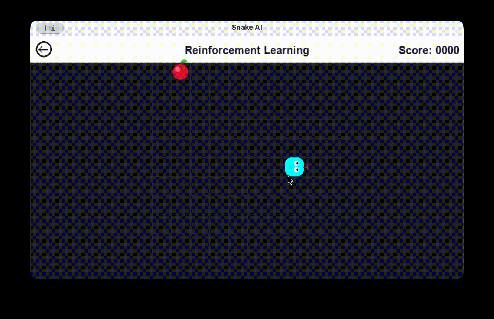
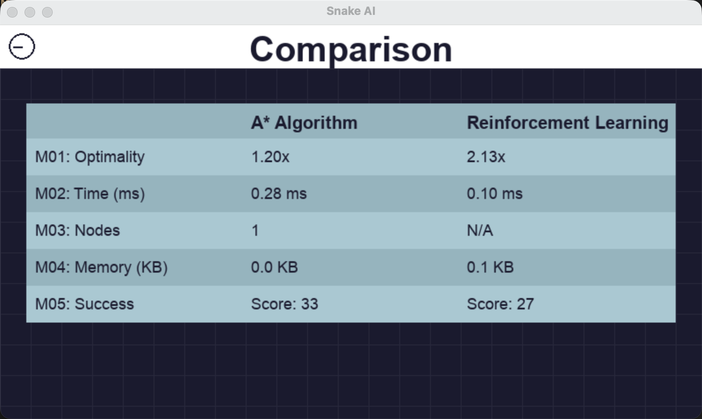
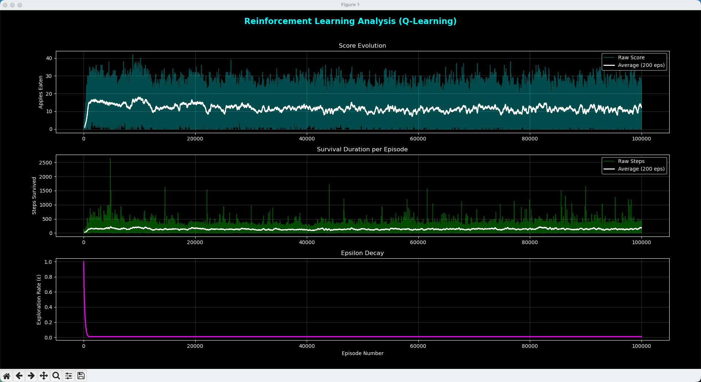
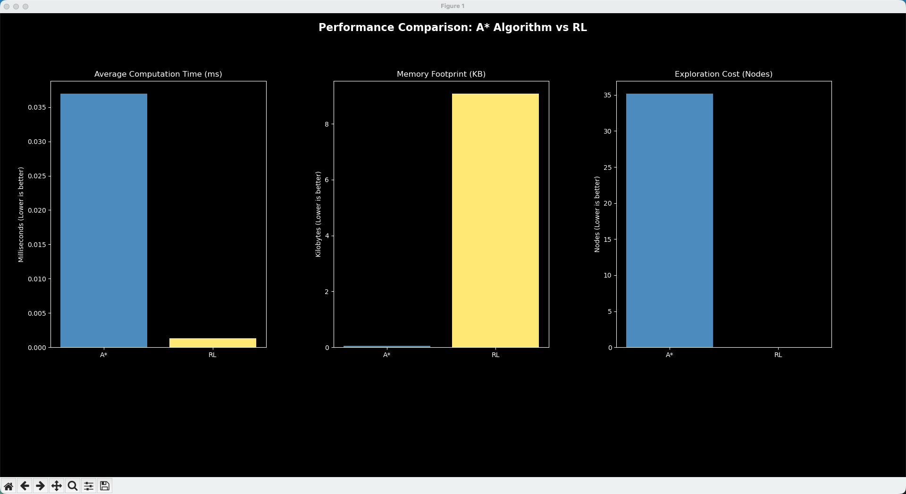

# Snake AI: A* Pathfinding vs. Reinforcement Learning

This project is a comparative study of two artificial intelligence paradigms applied to the classic game "Snake": **Heuristic Planning (A*)** and **Autonomous Learning (Q-Learning)**.

Beyond just building the agents, this repository features a fully automated headless benchmarking suite and a robust data analytics pipeline to scientifically evaluate the classic trade-off between **compute speed (RL)** and **path optimality (A*)**.

## 🧠 The Agents

### 1. The Heuristic Planner: A* Agent 
Uses the **Manhattan Distance** heuristic to calculate the shortest path to the target in real-time. 
- **Dynamic Obstacle Avoidance:** Treats the snake's dynamic body as solid walls during path calculation. 
- - **Survival Mode:** Includes a fallback strategy where the agent will actively pick the safest adjacent cell to prolong survival if the optimal path is completely blocked by its own tail.

### 2. The Autonomous Learner: Q-Learning (RL) Agent
Implements tabular **Q-Learning** trained over 10,000 episodes. 
- **11-Sensor State Space:** Overcomes relative/absolute translation blind spots by tracking 11 distinct boolean variables: `[danger_straight, danger_right, danger_left, dir_up, dir_down, dir_left, dir_right, food_up, food_down, food_left, food_right]`.
- **Anti-Reward Hacking:** Features a carefully tuned reward structure (`+50` for food, `-100` for death, `0` for normal steps) and a 100-step **Starvation Timer** to prevent infinite loop exploitation.
- **$\epsilon$-Greedy Exploration Strategy:** Balances discovering new mechanics and exploiting known optimal moves by dynamically decaying the exploration rate ($\epsilon$) from $1.0$ down to $0.01$ throughout the training lifecycle.

## 🏗️ System Architecture
The codebase strictly adheres to the **Separation of Concerns** principle:

- **Environment (`environment.py`):** The core physics engine using `collections.deque` for $O(1)$ snake movement and collision detection.
- **Perception (`utils/state_encoder.py`):** Translates the raw Pygame grid into the 11-value boolean array for the RL Agent.
- **Simulation GUI (`main.py` & `interface.py`):** A Pygame-based GUI featuring a "Bleu Nuit" (Dark Mode) aesthetic and a real-time KPI dashboard.
- **Headless Benchmark (`benchmark.py`):** Runs 100 invisible, perfectly seeded game loops in seconds to calculate perfectly fair averages between the two algorithms.
- **Analytics Engine (`data.py`):** Uses Pandas and Matplotlib to generate learning curves and benchmark bar charts.

## 📊 Key Performance Indicators (KPIs)
The application tracks 5 core metrics to compare the two approaches:
* **M-01: Optimality** – Ratio between the actual path taken and the theoretical minimum (Manhattan distance).
* **M-02: Execution Time** – CPU calculation time per decision in milliseconds.
* **M-03: Exploration Cost** – Number of nodes opened in the search tree (A*).
* **M-04: Memory Footprint** – RAM usage (in KB) of the Q-Table vs. the A* OpenSet.
* **M-05: Success Rate** – Final apple score achieved before death.

## 📸 Showcase

### AI Agents in Action



### Analytics Dashboard




## 🛠️ Installation & Usage

1. **Clone the repo:**
   ```bash
   git clone https://github.com/mylene-zheng/Snake-AI-Battleground
   ```
2. **Install dependencies:**
   ```bash
   pip install pygame pandas matplotlib numpy 
   ```

3. **Train a new RL Agent from scratch:**
   ```bash
   python train.py
   ```

4. **Run the simulation:**
   ```bash
   python main.py
   ```
5. **View Training Analytics Dashboard:**
   ```bash
   python data.py
   ```
6. **Run the Headless Benchmark:**
   ```bash
   python benchmark.py
   ```

## ⚙️ Hyperparameters (Q-Learning)

| Parameter                | Value      | Justification                                                       |
| :----------------------- | :--------- | :------------------------------------------------------------------ |
| **Training Episodes**    | 100,000    | Required to fully map the 11-sensor state space variations.         |
| **Learning Rate (α)**    | 0.1        | Ensures stable learning by avoiding drastic Q-Table oscillations.   |
| **Discount Factor (γ)**  | 0.99       | Gives high importance to achieving long-term goals (eating apples). |
| **Exploration Rate (ε)** | 1.0 → 0.01 | Encourages random exploration initially, shifting to exploitation.  |
| **Decay Rate**           | 0.995      | Multiplicative factor applied to ε after each episode.              |

## 👥 Authors
Ruowen ZHENG 

Lina BERBOUCHA
